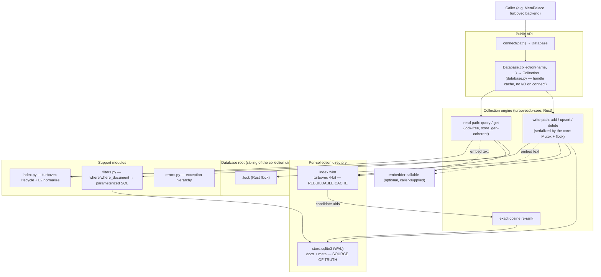

# Architecture

> **Implementation note (Rust rewrite).** This document was written against the
> v0.2.0 pure-Python implementation, and its file/line references
> (`collection.py:316` etc.) describe that code. The engine has since moved to
> Rust: the design below — the two-tier store, the invariants, the read/write
> paths, generations, locking — carried over 1:1, but the code now lives in
> `crates/turbovecdb-core` (pure engine) and `crates/turbovecdb-py` (PyO3
> adapter), with `src/turbovecdb/*.py` reduced to a thin wrapper that owns the
> locks and the public dataclasses. Read this for the *design*; for current
> code pointers see [rust-core-plan.md](rust-core-plan.md) and
> [rust-core-split-design.md](rust-core-split-design.md).

System map for turbovecdb (v0.5.0). Read this first; drill into the per-area docs in [Detailed docs](#detailed-docs) when you need depth.

## What this system is

An embedded, CPU-resident vector database. It pairs [turbovec](https://github.com/RyanCodrai/turbovec)'s 4-bit TurboQuant ANN index (fast approximate search) with a durable SQLite sidecar that holds documents, metadata, the string-id↔uint64 map, and the **exact float32 vectors**. Metadata filters, persistence, exact-cosine re-rank, and multi-process safety are built in. No server, no daemon, no network protocol — one or more processes open a directory. It ships no embedding model: bring your own vectors, or hand a collection an `embedder` callable.

The single load-bearing principle, from which everything else follows:

> **SQLite is the source of truth; the turbovec `.tvim` index is a rebuildable cache.**

Corollaries that shape the code:
 - **A crash never loses data and never returns wrong text.** The worst case is a stale or missing `.tvim`, rebuilt from SQLite on next open.
 - **Exact answers from an approximate index.** turbovec finds a candidate pool fast; turbovecdb re-ranks it with true cosine, so callers always get a correct `distance ∈ [0, 2]`, never turbovec's raw quantized score.
 - **Filters never silently degrade.** An unsupported operator raises `UnsupportedFilterError` rather than matching everything.
 - **Multi-process safe by construction.** No shared mutable index to corrupt — each process holds its own in-memory index, reconciled through one integer counter (`store_gen`).

## High-level diagram



## The data model (read once, recognize forever)

A `Database` is a directory; each collection is a subdirectory:

```
<db_path>/
  <collection_name>.lock          cross-process write lock (Rust core flock;
                                   sibling of the dir so it survives
                                   delete_collection's rmtree — see
                                   docs/core/concurrency.md)
  <collection_name>/
    store.sqlite3   durable source of truth (WAL; +.sqlite3-wal/-shm sidecars)
    index.tvim      turbovec serialized index — rebuildable cache
```

SQLite schema ([`collection.py:109`](../src/turbovecdb/collection.py)):

```sql
CREATE TABLE docs (
  uid      INTEGER PRIMARY KEY,   -- turbovec external id (uint64)
  str_id   TEXT UNIQUE NOT NULL,  -- caller's string id; docs table IS the id map
  document TEXT,                  -- verbatim text (may be empty)
  metadata TEXT,                  -- JSON object, queried via json_extract
  vector   BLOB                   -- float32 bytes, L2-normalized — the EXACT copy
);
CREATE TABLE meta (key TEXT PRIMARY KEY, value TEXT);
```

The `meta` table carries the lifecycle state:

| key | meaning |
|---|---|
| `dim` | vector dimensionality, committed on first add (must be a positive multiple of 8) |
| `bit_width` | turbovec quantization bits (2/3/4), default 4 |
| `metric` | distance metric (`cosine` only today) |
| `next_uid` | persisted monotonic `uid` allocator (never an in-memory guess → multi-writer safe) |
| `store_gen` | bumped on **every committed write** — the cache-coherence clock |
| `tvim_gen` | the `store_gen` the on-disk `index.tvim` was written at |

The `docs` table *is* the bidirectional `str_id ↔ uid` map. New ids draw from `next_uid`; an `upsert` of an existing `str_id` reuses its `uid` (turbovec `remove` + re-add), so ids stay stable across updates. Full treatment: [`docs/core/data-model.md`](core/data-model.md).

## Module layers

| Layer | File | Lines | Responsibility |
|---|---|---|---|
| Public API | [`__init__.py`](../src/turbovecdb/__init__.py) | 40 | Re-exports `connect`, `Database`, `Collection`, `QueryResult`, `GetResult`, the error types |
| Collection factory | [`database.py`](../src/turbovecdb/database.py) | 67 | `Database` = handle over a directory; `connect()` does no I/O; `collection()` opens/creates a subdir and **caches the handle per name** (a later call requesting conflicting options raises rather than silently reusing the first call's handle) |
| Engine | [`collection.py`](../src/turbovecdb/collection.py) | 435 | The read/write paths, index reload lifecycle, embedding hook, `QueryResult`/`GetResult` |
| Index lifecycle | [`index.py`](../src/turbovecdb/index.py) | 51 | `turbovec.IdMapIndex` build/load/atomic-write + `l2_normalize` (with zero guard); `DEFAULT_BIT_WIDTH=4` |
| Filters | [`filters.py`](../src/turbovecdb/filters.py) | 100 | filter dicts → parameterized SQL over the metadata JSON |
| Errors | [`errors.py`](../src/turbovecdb/errors.py) | 32 | `TurboVecError` base + `CollectionNotFoundError`, `UnsupportedFilterError`, `DimensionMismatchError`, `EmbedderRequiredError` |

## The write path — `add` / `upsert` / `delete`

All in the Rust core's `write` path (`crates/turbovecdb-core/src/collection.rs`), under the in-process `Mutex` (taken by the PyO3 layer inside `allow_threads`) and then the cross-process `flock`:

1. **Resolve vectors** (`resolve_vectors`): use caller's `vectors=`, or embed `documents=` via the collection's `embedder` (raises `EmbedderRequiredError` if none). All vectors are **L2-normalized** so cosine = dot product. This — and the fast embedder-identity pre-check — happen **before** the flock is taken (I5/R3), so a slow embedder never blocks other processes' writers; the identity is re-checked under the lock.
2. **Take the write lock**, then under it re-read `meta` (`next_uid`) and `ensure_current()` — so a second writer sees the first's committed rows before allocating ids.
3. **Commit dim on first write** (`_commit_dim`, [`collection.py:147`](../src/turbovecdb/collection.py)) — enforces `dim > 0 and dim % 8 == 0` (a turbovec requirement) or raises `DimensionMismatchError`.
4. **Allocate a `uid` per new `str_id`** from persisted `next_uid`; write the row to SQLite (durable step) and mirror it into the in-memory index (`add_with_ids`, or `remove`+re-add for upsert).
5. **Bump `store_gen`, commit.** The `.tvim` is **not** rewritten per call (that would be O(N) per batch) — it's flushed only on `flush()`/`close()`, marking `_dirty`.

## The read path — `query`

`Collection.query` ([`collection.py:316`](../src/turbovecdb/collection.py)) — lock-free, no file lock (WAL lets readers run alongside the single writer):

1. **Validate**: exactly one of `text` / `vector`. Embed `text` if given; L2-normalize the query vector.
2. **Staleness check** (`_ensure_current`, [`collection.py:179`](../src/turbovecdb/collection.py)): if `store_gen` advanced past `_seen_gen`, reload the index — `load_index` if `tvim_gen == store_gen`, else **rebuild from `docs.vector`** (`_reload_index`, [`collection.py:157`](../src/turbovecdb/collection.py)).
3. **Filter → allowlist**: compile `where`/`where_document` to SQL (`combined_sql`), select matching `uid`s, hand them to turbovec as an `allowlist`. Empty allowlist → empty result, short-circuit.
4. **Candidate pool**: ask turbovec for `max(k, _RERANK_FLOOR=50)` ([`collection.py:52`](../src/turbovecdb/collection.py)) ids.
5. **Exact re-rank** (`_rerank`, [`collection.py:354`](../src/turbovecdb/collection.py)): fetch candidates' float32 vectors from SQLite, compute `distance = 1 − dot(q, v) ∈ [0, 2]`, sort, return top `k`. This recovers the near-tie precision 4-bit quantization loses and hands callers a true cosine distance, not a quantization artifact.

`get` ([`collection.py:380`](../src/turbovecdb/collection.py)) is a pure SQL path (no ANN): filters + `ORDER BY uid` + `limit`/`offset`. Both return flat dataclasses; fields absent from `include=` come back empty (`vectors` is `None` unless requested), so you only materialize what you ask for. `include` resolution: `_resolve_include` ([`collection.py:76`](../src/turbovecdb/collection.py)).

## Filters

[`filters.py`](../src/turbovecdb/filters.py) compiles filter dicts to parameterized SQL over the metadata JSON column. The JSON **path** and every operand are bound parameters (`json_extract(metadata, ?) … ?`), never interpolated — arbitrary field names and values cannot inject SQL.

| Form | Example | Compiles to |
|---|---|---|
| bare equality | `{"lang": "en"}` | `json_extract(metadata,'$.lang') = ?` |
| `$eq`/`$ne`/`$gt`/`$gte`/`$lt`/`$lte` | `{"year": {"$gte": 2021}}` | `… >= ?` |
| `$in`/`$nin` | `{"lang": {"$in": ["en","fr"]}}` | `… IN (?, ?)` / `NOT IN (…)` |
| `$and`/`$or` | `{"$and": [c1, c2]}` | recursive, `AND`/`OR` joined |
| `where_document` `$contains` | `{"$contains": "fox"}` | `document LIKE ? ESCAPE '\'` |

Operator set is the Chroma/Mongo subset MemPalace's backend abstraction expects. Anything else (`$not`, `$nor`, a logical op with sibling keys, an empty `$in` list) raises `UnsupportedFilterError`. The resulting `uid` set becomes turbovec's search `allowlist` — filtering happens in SQLite, ranking in turbovec, re-ranking back in SQLite.

## Concurrency model

Designed for several processes on one directory — typically one writer (ingest) + N readers (server/CLI). Two mechanisms, both keyed on the `store_gen` invariant:

- **Writers serialized by a file lock.** Every `add`/`upsert`/`delete`/`flush`/`close` takes `<db_path>/<collection_name>.lock` — an `flock(2)` acquired by the Rust core (a sibling of the collection directory, not inside it — see [`docs/core/concurrency.md`](core/concurrency.md)). On Unix this is the same primitive Python `filelock` uses, so old-wheel and new-wheel processes still exclude each other (Windows interop is lost — `filelock` uses `msvcrt.locking` there; CI is Linux/WSL). Exactly one writer at a time → no lost updates, no `uid` collisions. In-process, a `Mutex` around the core (acquired inside `allow_threads`, never under the GIL) guards the connection and index. `uid`s come from persisted `next_uid`, never an in-memory guess.
- **Readers lock-free, coherent via `store_gen`.** Each `query`/`get` does a cheap `SELECT store_gen`; if it advanced, the reader reloads (loads a current `.tvim`, else sub-second rebuild from SQLite). A reader open for hours transparently picks up another process's writes on its next call. Refresh granularity is per-query, and reload is currently full (incremental reload is on the backlog).

There is no shared mutable index to corrupt — the contrast with HNSW-based stores that need single-writer daemons and corruption-recovery code. Full treatment + the tests that assert these guarantees: [`docs/core/concurrency.md`](core/concurrency.md).

## Design constraints worth knowing

- `dim % 8 == 0` (turbovec requirement) — violations raise `DimensionMismatchError`.
- `bit_width ∈ {2, 3, 4}`, default `4` (the recall ceiling).
- `metric="cosine"` only today; vectors normalized on the way in.
- **Single embedding model per collection** — mixing models silently corrupts the vector space. A stored-model-name guard is on the backlog (cf. MemPalace's `EmbedderIdentityMismatchError`, which this library does not yet enforce).
- Not a server, not an embedder, not a graph index.

## Recurring concepts

- **Source of truth vs. cache.** SQLite is durable and complete; `.tvim` is disposable. Every correctness argument reduces to this.
- **Generation counter as the clock.** `store_gen` (committed-write counter) + `tvim_gen` (what the cache reflects) drive both cold-start loading and live reader coherence.
- **Approximate find, exact rank.** turbovec narrows to a candidate pool; SQLite float32 vectors decide the order and the reported distance.
- **Fail loud on filters.** Unsupported operators raise, never silently widen the match set.
- **Lock for writes, counter for reads.** Writers serialize on the core's `flock` (cross-process) + `Mutex` (in-process); readers never take either and instead poll one integer.

## Common task → start here

| If you want to… | Open this first |
|---|---|
| Change how queries rank | `query` + `_rerank` in [`collection.py:316`](../src/turbovecdb/collection.py) |
| Add a filter operator | `_field_clause` / `where_to_sql` in [`filters.py`](../src/turbovecdb/filters.py) (and the supported-set note in [data-model](core/data-model.md)) |
| Tune the candidate pool size | `_RERANK_FLOOR` in [`collection.py:52`](../src/turbovecdb/collection.py) |
| Add a distance metric | `Collection.__init__` metric guard ([`collection.py:94`](../src/turbovecdb/collection.py)) + `l2_normalize`/re-rank assumptions |
| Change the on-disk schema | `Collection.__init__` DDL ([`collection.py:109`](../src/turbovecdb/collection.py)) + [data-model](core/data-model.md) |
| Touch index build/load/flush | [`index.py`](../src/turbovecdb/index.py) + `_reload_index`/`flush` in [`collection.py:157`](../src/turbovecdb/collection.py) |
| Understand multi-process safety | [`docs/core/concurrency.md`](core/concurrency.md) + `_write`/`_ensure_current` |
| Add a new error type | [`errors.py`](../src/turbovecdb/errors.py) (subclass `TurboVecError`) |
| Wire in an embedder | `embedder=` on `Database.collection`; `_embed` in [`collection.py:200`](../src/turbovecdb/collection.py) |
| Benchmark vs. another store | [`docs/performance/README.md`](performance/README.md) + `benchmark.py` |

## Detailed docs

| Need | File |
|---|---|
| Two-tier store, read/write paths, exact re-rank | [`docs/core/architecture.md`](core/architecture.md) |
| On-disk layout, SQLite schema, `.tvim` cache, generation counters, id map | [`docs/core/data-model.md`](core/data-model.md) |
| Multi-process model: write lock + lock-free reader coherence | [`docs/core/concurrency.md`](core/concurrency.md) |
| Benchmark methodology + measured results vs ChromaDB / exact kNN | [`docs/performance/README.md`](performance/README.md) |
| Public API quickstart | [`README.md`](../README.md) |
