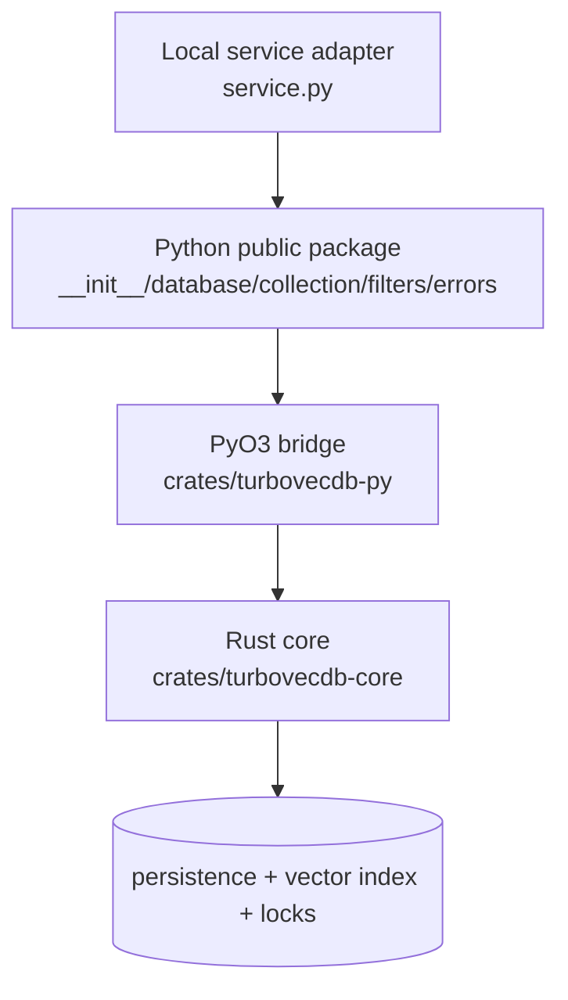

# TurboVecDB Architecture (graph-derived)

> Generated from the code-review graph of `turbovecdb` (community structure, file summaries,
> imports, caller/callee edges). Complements the hand-written `ARCHITECTURE.md`.
> Graph found ~40 matching files and a dedicated Python-facing community of ~65 nodes.

TurboVecDB is a local embedded vector database exposed as a Python package with a native Rust core.
The architecture separates user-facing Python ergonomics from Rust-owned persistence, vector
indexing, filtering, locking, and data integrity. The primary domain objects are `Database` and
`Collection`.

## Layer map

| Layer | Graph nodes | Responsibility |
|---|---|---|
| Python public package | `src/turbovecdb/{__init__,database,collection,filters,errors}.py` | Friendly API + DTOs + typed exceptions; delegates to the native core |
| Local service adapter | `src/turbovecdb/service.py` | HTTP-style command surface over `upsert`, `candidate_pairs`, `count`, `clear`; open/close + per-path lock |
| PyO3 bridge | `crates/turbovecdb-py/src/*.rs` | Converts Python objects/arrays/JSON filters/embedder callables into core calls; error conversion + module export |
| Rust core | `crates/turbovecdb-core/src/*.rs` | Collection lifecycle, persistence, indexing, filtering, concurrency, re-embedding, vector math, domain errors |
| Tests & performance | `tests/*.py`, Rust tests, `docs/performance/benchmark.py` | Python API behavior, concurrency/security/perf, core invariants, filter compilation, index round-trips |

## Key components

| Component | Layer | Role |
|---|---|---|
| `Database` | Python + Rust | Root handle; collection lookup/list/delete, name validation, directory management, context lifecycle |
| `Collection` | Python + Rust | add/upsert/delete/update/query/get/count/health/flush/close/reembed |
| `VectorIndex` / `TurbovecIndex` | Rust | Index load, add/remove/search/write, dimensionality + bit-width metadata |
| `filters` | Python + Rust | Compiles metadata/document predicates into bounded SQL clauses; rejects unsafe shapes |
| `Embedder` / `PyEmbedder` | Rust + Python callback | Identity-aware embedding for write/query/reembed |
| `FlockGuard` / lock helpers | Rust + Python service | Write/delete access + lock timeout coordination |
| `CoreError` / Python errors | Rust + Python | Maps domain failures into stable Python exceptions |

## Primary flows

| Flow | Graph path | Behavior |
|---|---|---|
| Collection creation/open | `connect(path)` → `Database.collection(...)` → core `ensure_collection` → `Collection.new` | Creates/opens dir, inits metadata, loads/rebuilds index, returns handle |
| Write path | `Collection.add/upsert` → core `write` → `resolve_vectors` → `acquire_write_lock` → `check_embedder_identity` → `write_locked` | Validates dims, embeds, serializes rows, mirrors to index, commits under lock |
| Query path | `Collection.query` → core `query` → identity/embed → `ensure_current` → `query_allowlist` → index `search` → SQL hydration | Builds query vector, filters, searches, hydrates, sorts/truncates → `QueryResult` |
| Filtered get/delete/update | `where`/`where_document` → filter compiler → SQL params → op | Bounded SQL fragments for get/query allowlist/delete/update |
| Re-embedding | `Collection.reembed` → identity checks → core `reembed` → metadata update + index rebuild | Recomputes vectors, supports dim changes, records identity, blocks mismatched embedders |
| Service command | `Handler.do_POST` → `op_*` → `_open` → op → `_close_db` | Process-local request handling over the same Python API |

## Core invariants

| Invariant | Rule |
|---|---|
| Name safety | Collection names validated/normalized before filesystem access |
| Dimensionality | Writes reject dimension mismatches; metadata records dim + bit width |
| Embedder identity | Writes, text queries, reembed enforce identity consistency |
| Index coherence | Writes mirror to index; health reports coherence; reload can rebuild |
| Concurrency | Write/delete use lock files/guards with timeout variants |
| Transaction recovery | Commit-failure paths roll back for clear/update |
| Filter bounds | Rejects unsupported operators, excessive nesting, empty `$in`, long lists, malformed predicates |

## Testing signals

| Area | Coverage |
|---|---|
| Python API | `test_collection.py`, `test_service.py`, `test_health.py`, `test_filters.py`, `test_embedder.py` |
| Concurrency & persistence | `test_concurrency.py`, `test_constructor_race.py`, `test_lock_timeout.py`, `test_wal_checkpoint.py`, `test_context_manager.py` |
| Maintenance ops | `test_reembed_fixes.py`, `test_chunked_rebuild.py`, `test_seen_gen.py`, `test_list_collections.py` |
| Security & behavior | `test_security.py`, `test_p3.py`, `test_performance.py`, `docs/performance/benchmark.py` |
| Rust core unit tests | Database validation, collection CRUD/query/reembed, filter bounds, index round-trips, rollback, coherence |

## Design constraints & extension

- **API stability:** keep Python DTOs and exceptions stable — they are the user-facing contract.
- **Persistence safety:** any write/delete/reembed must preserve lock acquisition, rollback, WAL/index coherence, and metadata updates.
- **Vector semantics:** dimension, bit width, normalization, and embedder identity must stay aligned across Python, PyO3, and core.
- **Extension:** add user features at the Python `Collection`/`Database` layer only after the Rust core owns the invariant. Bridge changes stay thin. New query/filter features start in `turbovecdb-core` filter compilation, then mirror through PyO3 and Python.

> Graph-only caveat: derived from graph metadata, communities, file summaries, imports, and edges;
> it does not include source-level details not represented in the graph.
